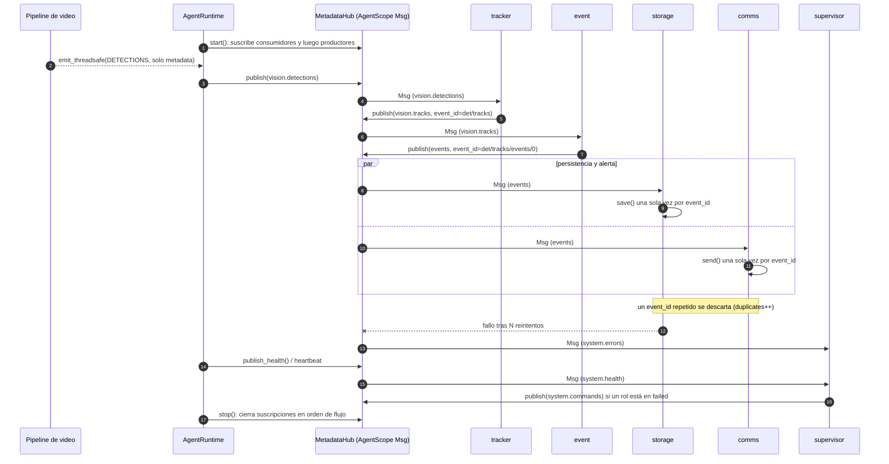

# Runtime AgentScope y orquestación de metadata

Implementa el issue #14: los siete roles de `MULTIAGENT_ROUTE` intercambian
metadata tipada a través de `MetadataHub`, con ciclo de vida, reintentos,
eventos de error e idempotencia. El video nunca entra en este plano.

## AgentScope 2.x no tiene `MsgHub`

La API pública de 2.x expone `agentscope.message.Msg` y `Agent.observe(msg)`
(el agente recibe contexto sin generar respuesta). El adaptador
`AgentScopeHub` (`src/bus/agentscope_hub.py`) usa solo eso:

- cada `MetadataEnvelope` validado viaja como un `Msg` (`id` = `event_id`,
  envelope completo en `metadata["condor_envelope"]`);
- los agentes AgentScope adjuntos con `attach_agent` (los ReAct `event` y
  `supervisor`) reciben el `Msg` con `observe`;
- `agentscope` se importa de forma diferida (cargarlo tarda ~2 s).

`InMemoryHub` (`src/bus/memory.py`) es la implementación determinista para
pruebas; `AgentScopeHub` la extiende. Ninguno aplica reglas de negocio.

## Capas

| Capa | Módulo | Responsabilidad |
|---|---|---|
| Contrato | `bus/hub.py` | `Topic`, `MetadataEnvelope`, versiones, validación, errores |
| Transporte | `bus/memory.py`, `bus/agentscope_hub.py` | Entrega de mensajes |
| Ciclo de vida | `agents/runtime.py` | Arranque/parada, reintentos, deduplicación, salud |
| Negocio | `agents/handlers.py` | Lógica de cada rol, efectos por puertos inyectables |

## Contrato del envelope

| Campo | Descripción |
|---|---|
| `schema_version` | Versión del envelope (`SCHEMA_VERSION = 1`) |
| `payload_version` | Versión del payload por tópico (`register_payload_versions`) |
| `event_id` | Identificador único; clave de idempotencia |
| `correlation_id` | Cadena completa (por defecto, el propio `event_id`) |
| `causation_id` | `event_id` del mensaje que lo originó |
| `created_at` | Marca de tiempo UTC |

- `Topic.ERRORS` (`system.errors`) transporta los eventos de error.
- Un tópico, versión o payload inválido falla al publicar con un error claro
  (`InvalidTopicError`, `UnsupportedVersionError`, `InvalidEnvelopeError`),
  incluidos payloads con datos binarios (frames).
- `envelope.derive(...)` crea hijos con `event_id = <padre>/<sufijo>`:
  determinista, así reprocesar la misma entrada produce las mismas salidas.

## Garantías del runtime

- **Arranque**: consumidores primero, productores al final; si un rol falla
  se revierten los ya iniciados (`RuntimeStartError`).
- **Parada**: en orden de flujo; cada etapa vacía su cola antes de cerrar.
- **Reintentos**: `RetryPolicy` (backoff exponencial). Agotados, se publica un
  evento en `system.errors` y el supervisor lo observa.
- **Idempotencia**: cada rol descarta `(tópico, event_id)` ya procesados. Un
  fallo no marca el evento como visto, por lo que una reentrega se reintenta.
- **Ruta**: un rol solo publica en `route.publishes` (más `system.errors`).
- **Salud**: `runtime.health()` y `publish_health()` / heartbeat
  (`heartbeat_interval`); solo metadata operativa.
- **Pipeline**: `emit_threadsafe(...)` permite a los callbacks del pipeline
  (hilos GStreamer) publicar metadata sin acceder al bus asyncio.

## Secuencia

